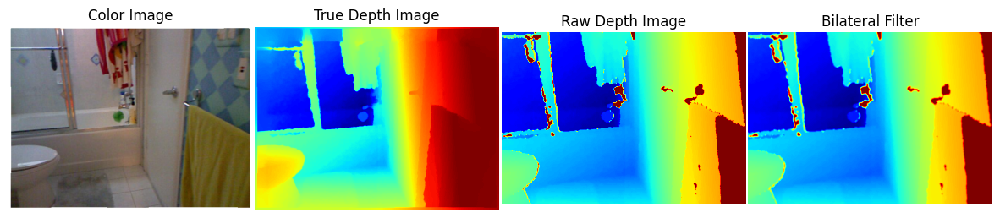
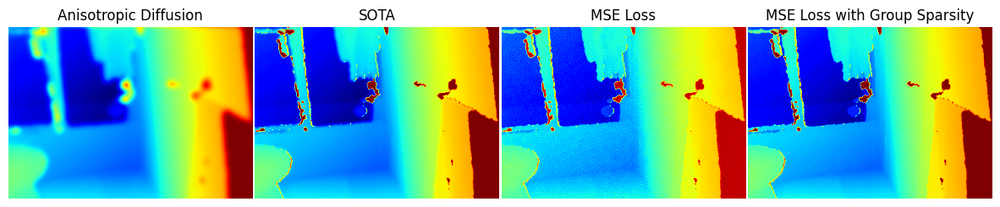
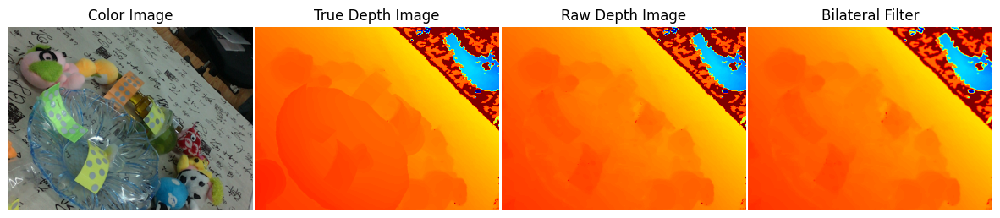
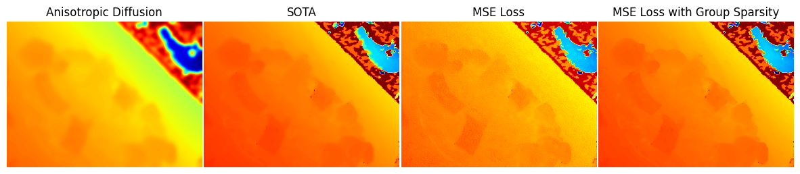

# Abstract

<ins>Abstract</ins>  

 Depth maps are a critical part of many computer vision tasks such as segmentation, pose estimation and 3D object detection. However the depth images captured from commerical sensors suffer from multiple sources of noise which can lower the confidence levels of downstream tasks which utilize depth maps for making decisions such as in autonomous driving and robotic vision. Because commerical sensors capture both RGB and Depth images at the same time, it is possible to use the scene information present in the RGB image to denoise the depth image because of shared structure between the two, furthermore RGB Imaging technology has matured enough that RGB Images can be considered almost devoid of noise. 
   

 The goal of this project was to train a denoiser in a self-supervised manner, since most publicly available datasets only contain the noisy images captured and rarely if not at all contain the associated ground truth since the process of creating such clean-noisy pairs requires human effort to create the groundtruths either synthetically or to vet the clean images. The proposed architecture is a U-Net based neural network that is trained in a self-supervised based manner on the noisy RGBD images. By injecting the color information into the architecutre the U-Net architecture successfully leverages the color information present inside the RGB image to denoise depth images, and is capable of denoising depth images generated by other datasets/devices when evaluated in a zero-shot manner. 

<ins>Results</ins>  

 <b>Generated Results for NYU Depth Dataset </b> 
  

 <b>Generated Results for the TransCG Dataset </b>
 

  
  

 Table 1: Results of Various Algorithms against two datasets on MAE and RMSE Metrics 
  

Dataset | Metric | Bilateral Filter | Anisotropic Diffusion | SOTA [1] | MSE w AWGN Noise | MSE | MSE w Group Sparsity  | MSE w downstream tasks
---| --- | --- | --- | ---| ---| ---| --- | --- 
NYU Depth Dataset |  MAE |  16.41mm|  44.34mm|  <b>8.58mm</b>|  16.74mm|  11.75mm|  10.01mm| 15.31mm
NYU Depth Dataset |  RMSE | 37.62mm| 196.89mm| 30.15mm| 36.30mm| <b>30.05mm</b>| <b>24.73mm</b>| 34.21mm| 
TransCG Dataset |  MAE |  41.03mm| 49.24mm| <b>11.02mm</b>| 31.01mm| 35.99mm| 16.35mm| 37.81mm| 
TransCG Dataset |  RMSE|  84.90mm| 169.32mm| 37.78mm| 42.12mm|  46.30mm| <b>32.45mm</b>| 49.05mm| 

 Table 2: Time to process one frame for various algorithms 

  
Algorithm |  Inference Time 
---|  ---
Bilateral Filter |  22ms 
Anisotropic Diffusion based Filter |  0.64s
SOTA [1] |  16ms - On a T4 GPU (8GB of RAM)
Proposed Architecture (UNet) |  12.8ms - On a T4 GPU (8GB of RAM)
  
# Team

* Vasu Eranki 

# Required Submissions

* [Proposal](proposal.md)
* [Midterm Checkpoint Presentation Slides Hosted on  Google Drive](https://docs.google.com/presentation/d/1Kyzuc4vfThnysSqpJy_nGMxYRILOdqt1/edit?usp=sharing&ouid=109510607650224076456&rtpof=true&sd=true)
* [Midterm Checkpoint Presentation Slides Hosted on Github](https://github.com/Vasu-Eranki/DenoisingDepthImages/blob/main/Presentation%20Material/MidtermPresentation.pdf)
* [Final Presentation Slides Hosted on Google Drive](https://docs.google.com/presentation/d/1Qz5Prh5TxgHiTDqIplJr0FZuXQBvTlMh/edit?usp=sharing&ouid=109510607650224076456&rtpof=true&sd=true)
* [Final Presentation Slides Hosted on Github](https://github.com/Vasu-Eranki/DenoisingDepthImages/blob/main/Presentation%20Material/FinalProjectPresentation.pdf)
* [Final Report](report.md)
