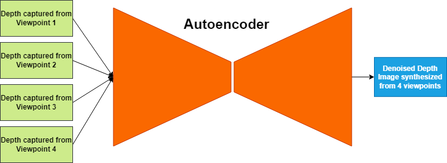
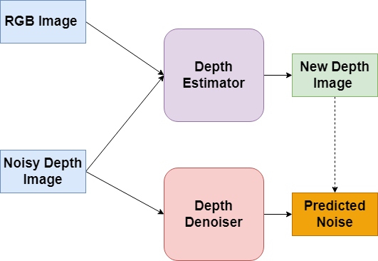
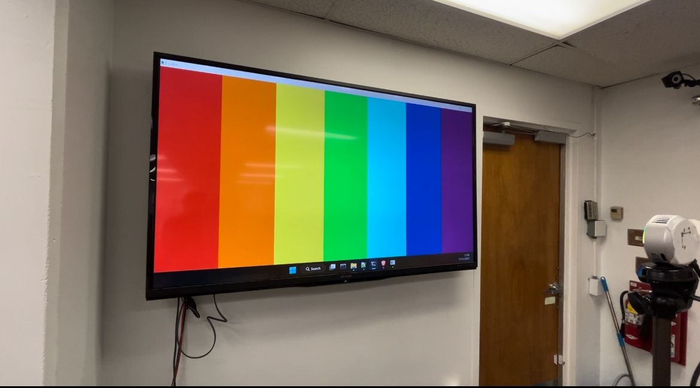
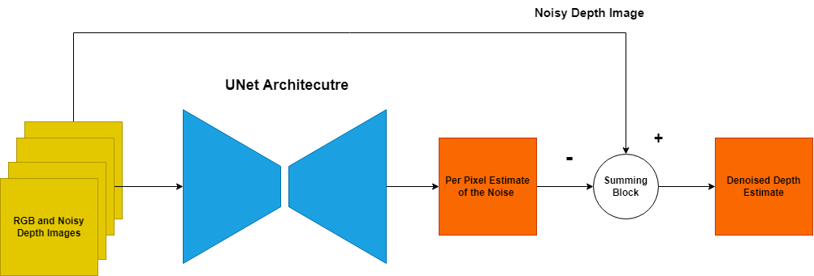
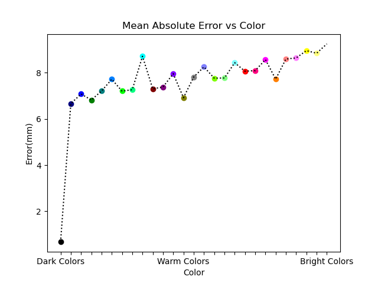
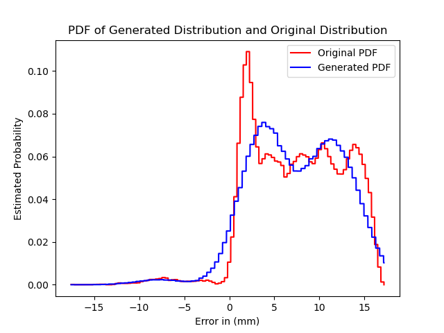
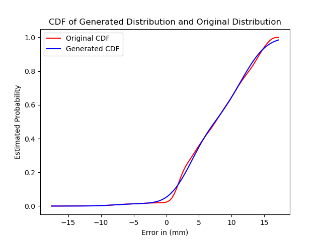
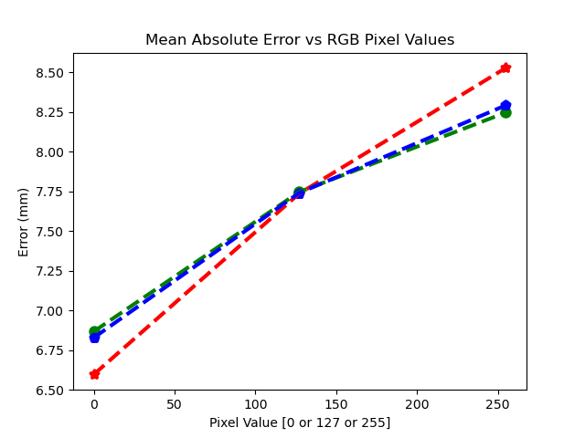

# Table of Contents
* [Abstract](#Abstract)
* [Introduction](#1-introduction)
* [Related Work](#2-related-work)
* [Technical Approach](#3-technical-approach)
* [Evaluation and Results](#4-evaluation-and-results)
* [Analysis and Conclusions](#5-Analysis-and-conclusions)
* [References](#6-references)

# Abstract

 Depth maps are a critical part of many computer vision tasks such as segmentation, pose estimation and 3D object detection. The depth images captured from commerical sensors suffer from multiple sources of noise which can lower the confidence levels of downstream tasks which utilize these depth maps for making decisions such as in autonomous driving and robotic vision. Because commerical sensors capture both RGB and Depth images at the same time, it is possible to use the scene information present in the RGB image to denoise the depth image because of shared structure between the two. 
     

 The goal of this project was to train a denoiser in a self-supervised manner, since most publicly available datasets only contain the noisy images captured and rarely if not at all contain the associated ground truth images since the process of creating such clean-noisy pairs requires human effort to to vet the clean images or to create the groundtruths synthetically. The proposed architecture is a U-Net based neural network that is trained in a self-supervised based manner on the noisy RGBD images. By injecting the color information into the architecutre the U-Net architecture successfully leverages the color information present inside the RGB image to denoise the depth images, and is capable of doing so even when its evaluated on other datasets/devices in a zero-shot manner. 

# 1. Introduction

## 1. Motivation & Objective

Depth maps are a critical part of many computer vision tasks such as segmentation, pose estimation, 3D object detection. However the depth images procured from consumer level senors has non-negligble amounts of noise present in it, which can interfere with the downstream tasks that rely on the depth information to make a decision such as in autonomous driving. The goal of this project is to leverage data driven models such as neural networks to denoise depth images by incorporating the information present about the scene in the RGB image.

## 2. State of the Art & Its Limitations  

Currently, there are two school of thought on how to tackle this problem, a supervised approach and a self-supervised approach. Because for this project, the goal is to denoise the image without having access to the ground truth, more focus will be on the self-supervised based state of the art model.
  

There are two neural network models which were proposed in 2019 and 2022 respectively which are the state of the art in depth denoising. The first paper proposed by Sterzentsenko et.al [1] captures the same scene by four different sensors and then uses the fact that the noise from each sensor will be slightly different because of the difference in vantage points and uses this information to denoise the final image. They were able to achieve a MAE of 25.11mm, on a custom dataset that wasn't released to the public. The limitations of this paper are that during training it requires 4 different depth images taken from four different vantage points to denoise the image. A visualisation of their architecture is shown in Fig.1 
 

<kbhd>

</kbhd>

 Fig 1. Visualisation of the Architecture that used multi-view supervision 

 The second paper proposed by Fan et.al in 2022 [5] uses depth estimation as a prior to denoising, and the authors were able to achieve a MAE of 32.8mm on the ScanNet Dataset [11]. The neural network model is trained end to end. The first stage is a depth estimator, and the second stage is a depth denoiser. The imputed depth image is then fed to the depth denoiser which predicts the residual between the original image and the imputed image. During inference, the residual is added to the original noisy depth image to render a denoised depth image. The limiation of this model is similar to the last one, which is that it requires training a depth estimator as well to achieve the task of depth denoising, this requires copious amounts of training data and GPU resources. A visualisation of the training process is shown in Fig.2 
   

<kbhd>

</kbhd>

Fig.2 Visualisation of the Architecture that used depth estimation prior to denoising

## 3. Novelty & Rationale

<ins>Approach</ins>

The proposed approach draws direct inspiration from monocular depth estimation where the depth image is directly estimated from the RGB image. The goal of this project is to fuse the information from the RGB image to denoise the depth image, in a self-supervised manner. The novelty in our approach is that without the use of any additional information in the form of different vantage points [1] or additional stages [5], a noisy depth image is denoised by the system. 
  

<ins>Rationale</ins>  

TOF sensors rely on the delay between emitting and reflection of a light signal to calculate the delay. An object further away from a sensor will have a longer delay and an object closer to the sensor will have a shorter delay. The texture of the object and the color of the object also affect the reflected light and the goal of this project is to focus on the latter. Object colored white will reflects more light when compared to other colors, and objects colored black will reflect very little light when compared to others. The color of the object matters in the amount of light reflected back to the TOF sensor and therefore the amount of noise present in each pixel has a direct relation with the associated color of that pixel, therefore theoretically it should be possible to leverage the color and scene information present in the RGB image to denoise a depth image because of the correlation between color and reflected light.
  

 Furthermore, it is possible to build a basic noise model from observing the noise response to three colors which are red, green and blue since all colors can be constructed as a combination of the three. Therefore the rationale of this project relies on basic color theory that all colors can be constructed from three colors and that colors influence the amount of light reflected back to the sensor which in turn can change the amount of noise introduced to the depth information captured for each pixel.
  

## 4. Potential Impact

 The goal of this project is to show that monocular depth denoising is possible, which means that the input to the model is a noisy RGB-D image and the output is a clean RGB-D image. The ramifications would be a model that is faster and easier to train, since it wouldn't require a larger end-to-end system or multiple sensors capturing the same scene. From an inference perspective, monocular depth denoising would help process frames closer to real-time system requirements since the number of frames that can be processed in a second would be comparatively more than a system which is more complex or requires fusing multiple frames. The  broader perspective is that moncocular depth estimation, could help in downstream tasks like robotics and autonomous driving which require clean depth images in real-time to make sound decisions. 
  

## 5. Challenges
 
<ins>Challenges</ins>
- Training a DNN based denoiser without ground truth images, will be a challenge. Without the ground truth, there is no simple way to evaluate the amount of noise the denoiser removes from the image since there is no prior to condition it on. 
- Ensuring that sample bias doesn't happen when collecting data to create a simple noise function. Sample bias can show up in two forms:
     - The noise model only works for the specific sensor for which it was collected
     - The noise model only works for specific environment conditions (If surfaces are sleek, ambient light intensity is less than a specific value)       

<ins>Risks</ins>
- The correlation between color and noise is weak or none when it was assumed that there was a strong correlation between the two
- The proposed model only works for specific sensors and is not model agnostic
- The proposed model is less robust to removing noise than other more complex models proposed in [[1]](#1)-[[5]](#5)

# 2. Related Work

 There are two schools of though in regards to depth denoising as mentioned before. The focus of this literature survey would be on the models trained in a self-supervised/ unsupervised manner.

 In Sterzentsenko et.al [1], the authors proposed a multi-view supervision network which leverages the fact that the same scene taken at different angles has different amounts of noise present in it since the noise isn't static. The input to the network is 4 depth maps taken at slightly different angles and the output is the 'fused' denoised depth map. While the model is State of the Art (SOTA), it does require 4 different training images and since there is no dataset that has this structure. A custom dataset would need to be used for training the model.

 The second paper proposed by Fan et.al [5] which has been mentioned above uses a depth estimator to create pseudo-ground truth estimates which are then used by the denoiser for training. In the paper both networks were trained in parallel, but for practical reasons, the depth estimator could be fixed whilst training the depth denoiser. The computational requirements for training both make it an undesireable trait for training on large datasets/models .

 Similar to the earlier paper proposed by Sterzentsenko et al., In [4] the model proposed by Dong et.al uses a concept similar to multi-view supervision wherein using a pyramid based convolutional neural network, multiple patches of different sizes are extracted from the depth image, which are then used to denoise the image. Extracting multiple patches allows the CNN to have access to both the local characteristics as well as the global characteristics where the former offers more information about the noise and the latter offers more information about the scene thereby preventing the model from removing high frequency details like edges from the image. 

  Yan et.al [15] proposed a diffusion based model to denoise RGB Images, wherein noise is iteratively added to the ground truth image during the forward process of diffusion. During the reverse process, the denoised image is recovered and compared against the original ground truth, which in turn implies that the authors were training a autoencoder based denoiser since at each step the input to the model was a noisy image and the output was the denoised estimate. This was repeatedly done with multiple levels of noise to simulate the diffusion process, which has a two fold effect. The authors were able to augment their dataset and make their model more robust to noise. 

 Besides the neural network based implementations mentioned above, Yan et.al [3] proposed a convex optimization based framework that denoises an RGB image by reducing the nuclear norm of the image, which is a proven heuristic in denoising since most physical processes can be expressed as low order dynamical systems. Therefore, by reducing the rank of the matrix (Image) the authors were successfully able to denoise the image, in a zero-shot manner. 

# 3. Technical Approach 
The project can be divided into two subparts which are:
 - Creating a noise function
 - Training a Denoiser

 <ins> Creating a Noise Function </ins>
 
 Time of Flight sensors suffer from noise which depends on the distance of the scene captured as well as the intensity of the scene captured. If a scene has objects further away from the sensor, the reflected signal firstly undergoes attenuation because of the distance; the signal undergoes further attenuation because of multipath interference, which can destructively interfere with the reflected LiDar Signal. 

The second parameter that affects the amount of noise present in the image is intensity, because for LiDar based sensors such as Intel L515 [9], the laser transmits a pusled signal with a wavelength of  *860nm*. Unfortunately the same wavelength is present in ambient sunlight and other light sources such as Halogen bulbs and LED's. In the presence of such sources, the sensor is unable to distinguish between the received signal and the ambient light, this causes spurious and anomalous depth measurements.  

Since there was no dataset that had color-depth noise pairs, manual data collection was done where multiple colours were flashed on a screen like the one shown in Fig.3, and the associated depth readings were captured. To mitigate the impact of distance and intensity based noise, the readings were actually taken in a dark room with no other soure of light and the distance between the screen and the display unit was fixed at 0.5m. To prevent transient or spurious noise from entering the depth measurements, the depth readings were averaged over a 100 frames for each colour. Since the depth was fixed, the process to calculate the noise was quite simple; by subtracting the true depth from the measured depth, the noise distribution for each colour was found and this was then used in creating a noise based function. This procedure was done for a total of 27 colors ranging from Black to White.  
 

  <kbhd>
  
  </kbhd>
 Figure 3. Depiction of Setup

After acquiring the color-noise pairs, the next step was to create a parameterized noise function that could be applied to training the neural network. Initial attempts with using a Random Forest and K-Nearest Neighbours failed since these methods were not able to scale well during training. A Gaussian Mixture Model (GMM) was instead used since the noise distribution did resemble a gaussian noise function. The mixture model was constrained to only have 3 components to emulate the noise introduced by R, G and B. 
   

 <ins> Training a Denoiser </ins>  

 The proposed architecture was heavily inspired by a denoising U-Net
 proposed by [14] to denoise RGB images. Unlike the former model which generated the denoised image at the output, the proposed model generates the per pixel estimated noise in the image, which is then subtracted from the noisy depth image to generate the denoised depth image A visualisation of the training procedure can be seen in Fig.4 . This was done to help stabilize training since depth values vary from image to image and are not bounded while the estimated noise is bounded. By creating a bounded output, the risks of experiencing exploding gradients were mitgated. The minimize the risk of overfitting the model was trained with the following parameters :
 

 - Dropout of 50%
 - Learning Rate of $10^{-4}$ with a learning rate scheduler that reduces the learning rate by 10% each epoch
 - $L_{2}$ regularization of $10^{-4}$

<kbhd>
 
</kbhd>
 Fig 4. Visualisation of proposed architecture

Additional Details about the model are as follows:
 - Trained for a total of 10 Epochs on a Nvidia T4 GPU with 8GB of GPU RAM
 - Number of Trainable Parameters 2.6 Million

 The model was trained on the NYU Depth Dataset and evaluated on the TransCG Dataset in a zeroshot manner. During training, additional color based noise was added to the Depth channel in the RGBD image while keeping the RGB image untouched, before being passed to the model for training. This was done to inject the color based information into the model in hopes that it would learn to denoise the image by inspecting the RGB Image. As a control experiment, a model was trained with AWGN noise instead of color based noise to ascertain this. If the model truly did learn to denoise the depth image from RGB, the model trained on color based noise would outperform the model trained on AWGN noise. 

 3 Variations of the model were trained during the course of this project. In all three variations, the MSE loss was used to measure the difference between the denoised estimate and the true original depth. In the second variation, an additional sparsity constraint was added to the model to prevent it from overfitting by enforcing that the latent space projection of the image to be sparse.In the third variation of the model, the model received a gradient signal from a downstream tasks which for this project was a RGBD based Semantic Segmentation model [13]. The idea was that by seeing the difference in degradation in output between the denoised and original depth image, the model would learn to denoise better. Similar to Generative Adversarial Networks, but the Adversary here was fixed for the entire training time. 

# 4. Evaluation and Results

<ins>**Color Noise** </ins>

The results for the experiment involving color are shown below in Fig.5. Some of the interesting insights collected from the experiments ascertaining the relationship between color and noise are mentioned below:
- Brighter colors such as White, Pink and Yellow indicate the presence of higher noise in the associated depth pixel
- Noise isn't additive since the noise induced by R, G and B don't add up to final noise present in the depth image. All 3 channels interact with each other in a complicated manner
- The source of this error is in the sensor since every physics based reflection law contradicts the findings generated from below. The sensor used in the ToF camera must be frequency sensitive and thus some colours are better captured over others.
- The distributions of noise in the depth map can be approximated by a GMM effectively with 3 Gaussians, which can be seen from the *CDF* plot wherein the predicted *CDF* and the actual *CDF* are similar in nature.

 <kbhd>

  
 </kbhd>  

Fig 5: Parameterized Noise Function based on Color 

<ins> **Denoising Results** </ins>

  Sample Results from the various algorithms and models used for this experiment are shown below in Fig.6 and the results are tabulated in Table 1 and Table 2. The MAE (Mean Absolute Error) and the RMSE (Root Mean Squared Error) metrics were used for gauging the efficacy of each model. For the bilateral filter and anisotropic diffusion based filter, an out of the box implementation from OpenCV was used with minimal hyperparameter tuning. 

 <kbhd>

</kbhd>
 Fig.6 Results for each algorithm against the NYU Depth Dataset and TransCG Dataset

 Table 1: Results of Various Algorithms against two datasets on MAE and RMSE Metrics 

 Dataset |Metric| Bilateral Filter | SOTA [1] | MSE w AWGN Noise | MSE | MSE w Group Sparsity  | MSE w downstream tasks
---| --- | --- | --- | ---| ---| ---| ---
NYU Depth Dataset |  MAE |  16.41mm|  44.34mm|  <b>8.58mm</b>|  16.74mm|  11.75mm|  10.01mm| 15.31mm
NYU Depth Dataset |  RMSE | 37.62mm| 196.89mm| 30.15mm| 36.30mm| <b>30.05mm</b>| <b>24.73mm</b>| 34.21mm| 
TransCG Dataset |  MAE |  41.03mm| 49.24mm| <b>11.02mm</b>| 31.01mm| 35.99mm| 16.35mm| 37.81mm| 
TransCG Dataset |  RMSE|  84.90mm| 169.32mm| 37.78mm| 42.12mm|  46.30mm| <b>32.45mm</b>| 49.05mm| 

Table 2: Time taken by each denoising algorithm to process one depth image 

Algorithm |  Inference Time 
---|  ---
Bilateral Filter |  22ms 
Anisotropic Diffusion based Filter |  0.64s
SOTA [1] |  16ms - On a T4 GPU (8GB of RAM)
Proposed Architecture (UNet) |  12.8ms - On a T4 GPU (8GB of RAM)

# 5. Analysis and Conclusions

<ins>Analysis</ins>

 From Table 1, it can be seen that 2 of the 3 proposed models were able to surpass the SOTA model [1] on the NYU Depth Dataset on the RMSE metric by 6mm, which highlights the efficacy of leveraging the information present inside the color image, however it should be highlighted that the proposed models were trained on the MSE metric while the SOTA model wasn't, this is further evident from the average performance of the proposed models on the MAE metric. A great MSE performance and a lukewarm MAE performance might be indicative that the denoised images are smoother than needed and high frequency information such as edges are getting washed away. 

 The second point to be made is in comparison to the model trained solely on AWGN noise. From Table 1, what is seen is that the proposed models outperform the model trained on AWGN highlighting that the CNN was able to leverage the color based information to further denoise the depth image. When evaluated on the TransCG Dataset, the MSE model trained with an additional constraint to have a sparse latent space, outperformed the SOTA model in the RMSE metric by 5mm. What this highlights is the model's capacity to denoise images across ToF cameras since each camera would have its own unique color-noise function, the key takeaway from this would be the fact that by enforcing the latent space to be sparse. The model learnt to project the depth images reliably into a low dimensional vector which it then uses to estimate the noise. 

 Besides the neural network based methods described above, in the realm of classical computer vision based methods. The bilateral filter was able to remove some of the noise while preserving the shapes and features, whilst the anisotropic diffusion based filter pretty much smoothens out the entire image, removing most medium to high frequency features and leaving the low frequency features in place, which explains it poor performance on both datasets while the bilateral filter has comparable performance to neural network based models.   

<ins> Conclusion </ins>  

 By using a GMM to approximate the noise function. Color based noise was added to the noisy images which were in turn used to train the U-Net which estimated the amount of noise present in the images. The estimated noised is then removed from the image to generate the denoised depth image. From the three proposed models which involved training on a MSE loss and other additional constraints it can be seen from Table 1 that the model trained on MSE with an additional constraint of the sparsity on the latent space performed the best and even outperformed the SOTA [1] on the RMSE metric. Furthermore the same model was able to successfully denoise images in a zero-shot manner when evaluated on the TransCG dataset [12], highlighting that the model was device agnostic since the NYU depth dataset was collected on a Kinect Sensor while the TransCG dataset was collected on a Intel L515 [10]. 
   

<ins> Navigation </ins>  
* [Back to Index](#index.md)  
* [Back to Proposal](#proposal.md)

# 6. References

<a id="1">[1]</a>
Sterzentsenko, V., Saroglou, L., Chatzitofis, A., Thermos, S., Zioulis, N., Doumanoglou, A., Zarpalas, D. and Daras, P., 2019. Self-supervised deep depth denoising. In Proceedings of the IEEE/CVF International Conference on Computer Vision (pp. 1242-1251).   URL: www.openaccess.thecvf.com/content_ICCV_2019/papers/Sterzentsenko_Self-Supervised_Deep_Depth_Denoising_ICCV_2019_paper.pdf  

<a id="2">[2]</a>
Laine, S., Karras, T., Lehtinen, J. and Aila, T., 2019. High-quality self-supervised deep image denoising. Advances in Neural Information Processing Systems, 32.  URL: https://proceedings.neurips.cc/paper/2019/file/2119b8d43eafcf353e07d7cb5554170b-Paper.pdf  
<a id ="3">[3]</a>
Yan, C., Li, Z., Zhang, Y., Liu, Y., Ji, X. and Zhang, Y., 2020. Depth image denoising using nuclear norm and learning graph model. ACM Transactions on Multimedia Computing, Communications, and Applications (TOMM), 16(4), pp.1-17.  URL: https://dl.acm.org/doi/pdf/10.1145/3404374

<a id = "4">[4]</a>
Dong, G., Zhang, Y. and Xiong, Z., 2020. Spatial hierarchy aware residual pyramid network for time-of-flight depth denoising. In Computer Vision–ECCV 2020: 16th European Conference, Glasgow, UK, August 23–28, 2020, Proceedings, Part XXIV 16 (pp. 35-50). Springer International Publishing. URL: https://www.ecva.net/papers/eccv_2020/papers_ECCV/papers/123690035.pdf  

<a id="5">[5]</a>
Fan, L., Li, Y., Jiang, C. and Wu, Y., 2022, May. Unsupervised Depth Completion and Denoising for RGB-D Sensors. In 2022 International Conference on Robotics and Automation (ICRA) (pp. 8734-8740). IEEE. URL: https://ieeexplore.ieee.org/stamp/stamp.jsp?tp=&arnumber=9812392

<a id = "6">[6]</a>
Novkovic, T., Furrer, F., Panjek, M., Grinvald, M., Siegwart, R. and Nieto, J., 2019. CLUBS: An RGB-D dataset with cluttered box scenes containing household objects. The International Journal of Robotics Research, 38(14), pp.1538-1548.URL: https://clubs.github.io/  

<a id = "7">[7]</a>
Silberman, N., Hoiem, D., Kohli, P. and Fergus, R., 2012. Indoor segmentation and support inference from rgbd images. In Computer Vision–ECCV 2012: 12th European Conference on Computer Vision, Florence, Italy, October 7-13, 2012, Proceedings, Part V 12 (pp. 746-760). Springer Berlin Heidelberg. URL: https://cs.nyu.edu/~silberman/datasets/nyu_depth_v2.html  

<a id = "8">[8]</a>
Vasiljevic, I., Kolkin, N., Zhang, S., Luo, R., Wang, H., Dai, F.Z., Daniele, A.F., Mostajabi, M., Basart, S., Walter, M.R. and Shakhnarovich, G., 2019. Diode: A dense indoor and outdoor depth dataset. arXiv preprint arXiv:1908.00463.URL:https://diode-dataset.org/  

<a id = "9">[9]</a>
URL: https://www.intelrealsense.com/sdk-2/  

<a id="10">[10]</a>
URL:https://dev.intelrealsense.com/docs/lidar-camera-l515-datasheet

<a id = "11">[11]</a>
Dai, A., Chang, A.X., Savva, M., Halber, M., Funkhouser, T. and Nießner, M., 2017. Scannet: Richly-annotated 3d reconstructions of indoor scenes. In Proceedings of the IEEE conference on computer vision and pattern recognition (pp. 5828-5839).URL:http://www.scan-net.org/  

<a id = "12">[12]</a>Fang, H., Fang, H.S., Xu, S. and Lu, C., 2022. Transcg: A large-scale real-world dataset for transparent object depth completion and a grasping baseline. IEEE Robotics and Automation Letters, 7(3), pp.7383-7390.

<a id = "13">[13]</a>
Wang, Y., Chen, X., Cao, L., Huang, W., Sun, F. and Wang, Y., 2022. Multimodal token fusion for vision transformers. In Proceedings of the IEEE/CVF Conference on Computer Vision and Pattern Recognition (pp. 12186-12195).
<a id ="14">[14]</a>
Gurrola-Ramos, J., Dalmau, O. and Alarcón, T.E., 2021. A residual dense u-net neural network for image denoising. IEEE Access, 9, pp.31742-31754.

<a id = "15">[15]</a>
Yang, C., Liang, L. and Su, Z., 2023. Real-World Denoising via Diffusion Model. arXiv preprint arXiv:2305.04457.

## <ins>I. Acronyms</ins>

Acronym| Full Form
---| ---
SOTA| State-Of-The-Art
MAE | Mean Absolute Error 
RMSE | Root Mean Squared Error 
RGB-D | RGB - Depth Image
TOF | Time of Flight
DNN | Deep Neural Network  
GMM | Gaussian Mixture Model
